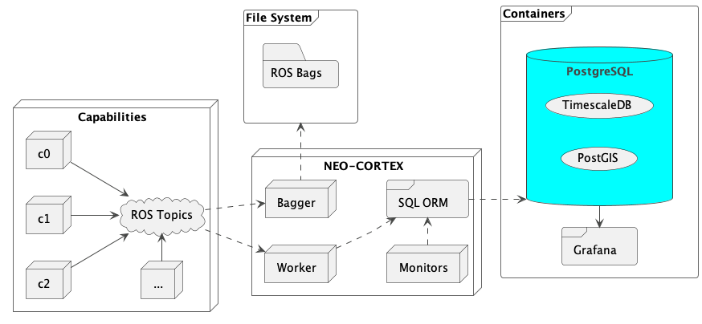

# CORTEX: Continuous Optimization in Robotics via Test and Exploration

> CORTEX was developed at NASA Jet Propulsion Laboratory (JPL) and is open sourced under
> the [Apache 2.0 License](LICENSE).
>
> The development of CORTEX was funded internally by JPL/JNEXT as part of the
> [Extant Exobiology Life Surveyor (EELS)](https://www.jpl.nasa.gov/robotics-at-jpl/eels) project, and builds on the NEO
> Autonomy Framework (hence, NEO-CORTEX). EELS is a snake
> robot that is being developed to explore the subsurface oceans of Europa and Enceladus. We encourage you to use CORTEX
> in your own projects, and to contribute to the project by submitting issues and pull requests. See
> the [References](#references) section for a list of relevant publications, documents, and projects.
>
> [EELS on the cover of Science Robotics - March 2024](https://www.science.org/toc/scirobotics/9/88)
>
> [EELS: Autonomous snake-like robot with task and motion planning capabilities for ice world exploration](https://www.science.org/doi/10.1126/scirobotics.adh8332)

# Description

CORTEX is a framework for accelerating robotics development through a combination of modern data infrastructure,
test automation, and intelligent data analysis. The framework enables developers to rapidly prototype and test new
algorithms and ideas with minimal effort. It also provides a set of tools for specifying and running experiments in a
repeatable manner, and for collecting and analyzing data from those experiments. Finally, CORTEX provides facilities for
single- and multi-device configuration management, logging, and monitoring, which are essential for managing and
operating complex robotics systems.

# Installation

To install the CORTEX Python library, clone the repository and run the following command:

```shell
python3 -m pip install --user -e .
```

After installing the CORTEX Python library, you can import the modules as follows:

```python
import cortex
from cortex.db import TemporalCRTX
from cortex.db.entities import *
# etc...
```

**See `notebooks/guides` for examples on how to use the CORTEX library.**

# Self-hosting with Docker

CORTEX relies on a database connection to store and retrieve data. We have provided a Docker setup which includes a
Postgres database with TimescaleDB, and a Grafana dashboard for visualizing. We will assume that you have Docker
installed on your system. If you do not have Docker installed, you can download it from the
[Docker website](https://docs.docker.com/engine/). The following commands require the `docker compose` command
to work properly.

Important: you must create the `PERSISTENCE_DIRECTORY` (see `.env`) before building the Docker containers.
This directory will be used to store the database and Grafana data. The default location is `~/Data`.

```shell
mkdir -p <PERSISTENCE_DIRECTORY_AS_SPECIFIC_IN_.ENV>
```

To build the Docker images, run the following command:

```
./setup.py docker --start    start the CORTEX services (Postgres and Grafana)
                  --stop     stop the CORTEX services
                  --restart  restart the CORTEX services
                  --purge    stop and remove the CORTEX services
                   
./setup.py database --init   populate the database with the necessary tables
                    --wipe   clear the database, including locally mounted volumes
```

In most cases, the Docker images will continue running in the background and start automatically when you restart your
computer. You may also choose to connect CORTEX to your own instance of Postgres by modifying the `.env` file.

## Configuration

The following components of CORTEX can be configured:

- Docker containers, see [docker-compose.yml](docker-compose.yml) and [.env](.env)
- Database (PostgreSQL w/ TimescaleDB), tables, etc., see [config/timescaledb/README.md](config/timescaledb/README.md)
- Device Metrics (Telegraf), see [config/telegraf/README.md](config/telegraf/README.md)
- Grafana (Dashboard), see [config/grafana/README.md](config/grafana/README.md)
- ROS Workers, see [src/cortex/config/workers/README.md](src/cortex/config/workers/README.md)

## Architecture

CORTEX is intended to work with a wide variety of robots and configurations. It is designed to be as
modular as possible, so that it can be easily adapted and integrated into new and existing systems. The following
diagram shows the high-level architecture of the CORTEX data framework:
[](docs/diagrams/cortex_architecture.png)

[//]: # (TODO: replace this with an updated diagram)

### Agents

CORTEX Agents can be thought of as components that are responsible for performing specific tasks in a robotics system.
They are typically implemented in the form of Python scripts, and can be configured using YAML files (where applicable).

CORTEX currently provides the following Agents:

- **worker**: responsible for listening to topics, applying preprocessors and transforms, and
  inserting data into the database. Note that the worker node will typically subsample the data before sending it to the
  database in order to reduce the amount of data that is sent.
- **monitor**: responsible for collecting resource utilization metrics (CPU/Memory) from nodes and processes running on
  the system.
- **annotator**: responsible for recording events that occur during an experiment. This includes recording the start and
  end times of an experiment, as well as significant events such as state transitions, reaching a goal, crashing, or
  encountering an obstacle.

#### Future Agents

We have developed additional agents but have not added them to the open source repository yet. These agents include:

- **ROSA (ROS Agent)**: an AI agent that uses LLMs to interface with ROS using natural language queries.
- **orchestrator**: manages the CORTEX system, including environment setup, configuration, and starting/stopping CORTEX
  services.
- **sampler**: collects data from sources that do not publish on open topics. This includes collecting data by
  performing service/action calls, or by reading data from files.
