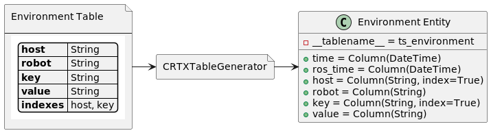

# Server Initialization

In previous versions, server initialization was a much bigger ordeal. Before the TimescaleDB dialect became available
for use in SQLAlchemy, the tables had to be declared both in SQL files and as SQLAlchemy classes in Python. However,
with the introduction of the TimescaleDB dialect, the SQL files are no longer required, making database initialization
dramatically simpler. In fact, the only initialization needed is to include the appropriate plugins (TimescaleDB,
PostGIS, etc.). 

That said, if you want to manually configure the database initialization, you can do so by adding SQL code to files in
the `init` folder. You will notice that the existing file(s) start with `xxx_`. These numbers are used to determine
the order in which the SQL files are run during initialization. If you want to add your own SQL files, make sure to
choose a `xxx_` prefix that has not already been chosen.

Finally, it is important to note that **database initialization only occurs once, when the Docker container is first
created.** Even if you stop the containers with `docker compose down` and delete the images, the database will
still exist in the persistence directory, and initialization will not occur the next time you start it. If you want
to redo the initialization step, the only option is to stop the containers and delete the persistence directory.
Alternatively, you can always open a `psql` console and run your commands manually, or write a python script
that does the same. However, care must be taken to ensure the script occurs very early in the lifecycle, so that
any code depending on the new changes does not crash as a result of an inconsistent database.

# Table Configurations

In order to simplify the process of creating tables in the database and making them accessible in the Python libraries,
we have devised a method for declaring the tables in YAML files (using a custom syntax) and using them to generate
SQLAlchemy entities (see diagram below). These YAML declarations are contained in the `./tables` folder:

- `relational.yaml`: declares traditional PostgreSQL relational tables, implies `id` column as primary key
- `timeseries.yaml`: declares TimescaleDB hypertables, implies `time` and `ros_time` columns

Each of these files have been populated with a default set of tables that should be widely applicable to all robotics
projects. You will likely want to define your own custom tables for your specific needs. In order to do so, you will
need to use the appropriate syntax in order to correctly generate the SQLAlchemy entities.

[](../../docs/diagrams/table_generation.png)

> Table generation process. Note that some columns are implicit and automatically defined based on the type of table.


In order to simplify the syntax, the following features are implemented and handled automatically upon generation:

- Table names are prepended with either `rel_` (relational) or `ts_` (time-series) depending on which file they are in.
- Relational tables receive column `id` as a primary key.
- Time-series tables receive columns `time` and `msg_time`, and are declared as TimescaleDB hypertables.
- A comma-separated list of table names may be used instead of a single name to create multiple tables with the same
  exact schema.
- The qualifiers `Nullable` and `Unique` may be added after the column type to specify nullable and unique columns
- Table names, regardless of how they are entered in the YAML file, will always be converted to lower case in the
  database, and the SQLAlchemy classes will always use CamelCase.

## CORTEX Table Specification

The YAML files accept a list of tables, each of which is defined by a list of their columns. The columns
are subsequently defined by their types and qualifiers. Finally, tables may optionally include the `indices` and/or
`foreign_keys` specifiers.

> **Note:** a great way to learn about the syntax is to look at the existing tables in the YAML files.

### Example

The following example illustrates correct usage of the syntax. See the [Grammar](#grammar) section for a more
formal description of the syntax and the available types and qualifiers.

#### YAML Declaration

```yaml
- annotation:
    robot: String
    host: String
    label: String
    message: String
    tags: String[], Nullable
    level: String, Nullable
    end_time: DateTime, Nullable
    indices: robot+label
```

#### Generated SQLAlchemy Entity

```python
class Annotation(Base):
    __tablename__ = "ts_annotation"

    time = Column(DateTime(timezone=True), nullable=False)
    msg_time = Column(DateTime(timezone=True), nullable=False)
    host = Column(String, nullable=False)
    label = Column(String, nullable=False)
    message = Column(String, nullable=False)
    tags = Column(ARRAY(String), nullable=True)
    level = Column(String, nullable=True)
    end_time = Column(DateTime(timezone=True), nullable=True)

    __table_args__ = ({
        'timescaledb_hypertable': {'time_column_name': 'time'}
    })


Index("annotation_robot_label_idx", Annotation.robot, Annotation.label)
```

#### Representative SQL

The following SQL is included for completion, but is not a product of the table generation process, as SQLAlchemy takes
care of that behind the scenes for us.

```sql
create table if not exists ts_annotation
(
    time     timestamp with time zone not null,
    msg_time timestamp with time zone not null,
    robot    text                     not null,
    host     text                     not null,
    label    text                     not null,
    message  text                     not null,
    tags     text[]                   null,
    level    text                     null,
    end_time timestamp with time zone null

);
select create_hypertable('ts_annotation', 'time', chunk_time_interval := interval '1 day', if_not_exists := TRUE);
create index if not exists annotation_robot_label_idx ON ts_annotation (robot, label);
```

### Grammar

The following pseudo-grammar describes the YAML syntax:
```
table_name :- [a-zA-Z_]+
column_name :- [a-zA-Z_]+
base_type :- String | Float64 | Int64
array_type :- <base_type>[]
column_type :- <base_type> | <array_type> | DateTime
column_qualifier :- Nullable | Unique | Nullable, Unique | Unique, Nullable
column_index :- <column_name> | <column_index>+<column_name> | <column_index>, <column_index>
foreign_key :- <table_name>.<column_name> | <foreign_key>, <foreign_key>
```

Using this grammar to create a table in YAML:
```
- <table_name> [,<tablename>]:
  <column_name>: <column_type> [,column_qualifier]
  ...
  [indices: <column_index>]
  [foreign_keys: <foreign_key>]
```