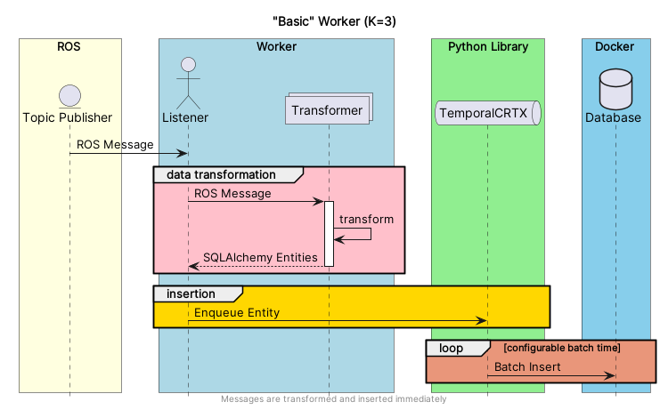
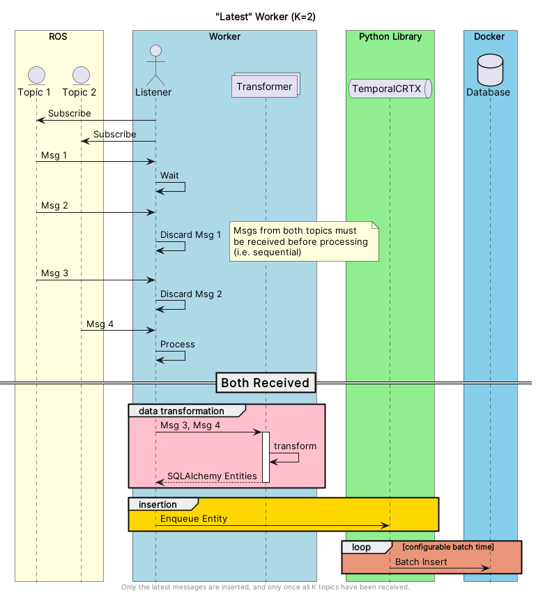
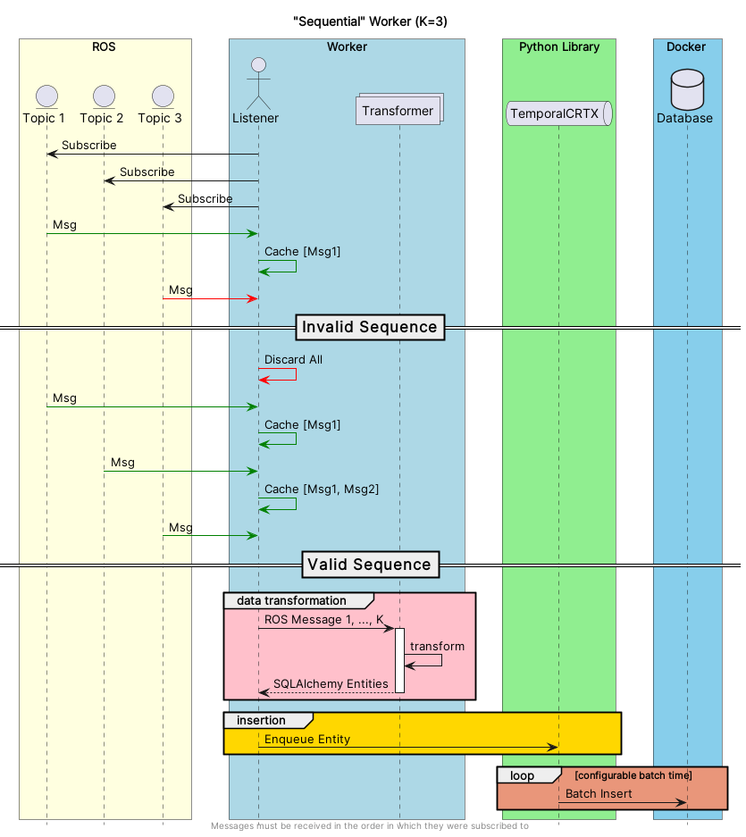

# CORTEX Worker Configuration

## Worker Pipelines

- `basic`: Transform messages as they are received (immediately).

- `latest`: Wait for all topics to be ready before transforming, overwriting older messages until all topics are
  received.

- `sequential`:

### Not Yet Implemented (coming soon)
- `approximate`: Apply transforms only if a message has been received on all specified topics within N seconds of each
  other.
- `sample` (default): Transform the latest messages from each topic at the specified rate, regardless of which messages
  are available.
